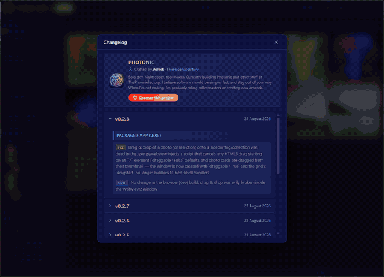

# Photonic

[](https://creativecommons.org/licenses/by-nc-nd/4.0/)
[](https://github.com/sponsors/DarkAdrick)

A local-first, lightweight Windows desktop photo management application.



📚 **[Wiki](https://github.com/DarkAdrick/Photonic/wiki)** — full documentation, FAQ and keyboard shortcuts.

## Quick Start

```bash
pip install -r requirements.txt
python run.py
```

Browser opens to `http://127.0.0.1:8765`.

## Screenshots

📖 Full illustrated walkthrough: [docs/userguide.md](docs/userguide.md).

### Library


### Photo Detail & 360° Viewer


### Map, Organization & Filters


### Cleaning & Statistics


### Settings


### Changelog


## Build

```bash
#Build.bat
```

Produces `dist\Photonic.exe` (standalone, windowed, no console).

## Stack

| Layer      | Tech                    |
|------------|-------------------------|
| Backend    | Python + FastAPI        |
| Frontend   | Vanilla HTML/CSS/JS     |
| Database   | SQLite (WAL mode)       |
| Server     | uvicorn                 |
| Packaging  | PyInstaller             |

## Project Structure

```
Photonic/
├── backend/
│   ├── __init__.py
│   ├── main.py              # FastAPI app, API routes, static file serving
│   ├── database.py          # SQLite schema + connection helpers
│   ├── scanner.py           # Folder scanning, EXIF extraction, file hashing
│   └── thumbnails.py        # Thumbnail generation (small/medium/large)
├── frontend/
│   ├── index.html           # App shell (header, sidebar, photo grid, dialogs)
│   ├── css/style.css        # Dark theme + photo grid styles
│   └── js/app.js            # API calls, photo grid rendering, folder dialog
├── docs/
│   └── userguide.md         # Illustrated user guide
├── data/                    # Runtime: SQLite DB (photonic.db)
├── cache/
│   └── thumbnails/          # small/ medium/ large/ (auto-generated)
├── requirements.txt
├── #Build.bat               # PyInstaller build script
├── run.py                   # Entry point
├── PROJECT.MD               # Full specification
└── README.md                # This file
```

## API Endpoints

| Method | Path                       | Description                            |
|--------|----------------------------|----------------------------------------|
| GET    | `/api/status`              | Server status, version, photo count    |
| GET    | `/api/folders`             | List all indexed folders               |
| POST   | `/api/folders`             | Add a folder (`{"path": "..."}`)       |
| POST   | `/api/scan`                | Start scan (`{"path": "..."}`)         |
| GET    | `/api/scan/status`         | Check if scan is running               |
| GET    | `/api/photos`              | List/search photos (see params below)  |
| GET    | `/api/photos/geo`          | Geo-tagged photos (bbox filter)        |
| GET    | `/api/photos/{id}`         | Get full photo metadata                |
| POST   | `/api/photos/{id}/rate`    | Set rating (`{"rating": 1-5}`)         |
| GET    | `/api/photos/{id}/thumb/{size}` | Get thumbnail (small/medium/large) |
| GET    | `/api/filters`             | Get distinct values for filter dropdowns |

## Database Schema

- **photos** — all photo metadata (EXIF, dimensions, GPS, hashes, ratings)
- **tags** — hierarchical tags (parent_id self-reference)
- **photo_tags** — many-to-many link between photos and tags
- **folders** — indexed folder paths

Indexes on: filename, extension, camera_make+model, date_taken, hash, perceptual_hash, tag parent.

### `/api/photos` query params

| Param      | Type   | Description                        |
|------------|--------|------------------------------------|
| `q`        | string | Text search (filename, camera, lens) |
| `camera`   | string | Filter by camera model             |
| `lens`     | string | Filter by lens                     |
| `ext`      | string | Filter by file extension           |
| `date_from`| string | Filter by date taken (YYYY-MM-DD)  |
| `date_to`  | string | Filter by date taken (YYYY-MM-DD)  |
| `rating`   | int    | Minimum rating (1-5)               |
| `folder_id`| int    | Filter by folder                   |
| `page`     | int    | Page number (default 1)            |
| `per_page` | int    | Results per page (default 80)      |

## Deviations from PROJECT.MD

The spec called for **Svelte** frontend. We chose **vanilla HTML/CSS/JS** instead:

- Fewer dependencies, simpler build (no Node.js / Vite required)
- FastAPI serves static files directly — single process, zero config
- Easier to maintain for a solo developer (YAGNI principle)
- Svelte components can be added later if the UI grows complex enough to justify it

## Development Status

### Phase 1 — Skeleton ✅

- [x] Python + FastAPI project
- [x] Vanilla HTML/CSS/JS frontend
- [x] SQLite with full schema (photos, tags, folders)
- [x] API endpoints (status, folders)
- [x] Dark-themed UI shell with sidebar
- [x] Frontend ↔ backend communication
- [x] Browser auto-open on startup

### Phase 2 — First Photo Library ✅

- [x] Folder scan (recursive, async, background thread)
- [x] Image file detection (JPEG, PNG, WebP, TIFF, BMP, GIF)
- [x] EXIF metadata extraction (camera, lens, GPS, date, aperture, ISO...)
- [x] File hashing (MD5 for exact duplicate detection later)
- [x] Thumbnail generation (small 160px, medium 400px, large 1024px)
- [x] Photo grid with thumbnails (CSS Grid, lazy loading)
- [x] Add Folder dialog
- [x] Scan progress polling
- [x] Sidebar folder list

### Phase 3 — Search & Filters ✅

- [x] Text search (filename, camera, lens)
- [x] Filter by camera / lens
- [x] Filter by date range
- [x] Filter by file extension
- [x] Filter by rating
- [x] Filter dropdowns populated from DB
- [x] Live search with debounce
- [x] Clear filters button

### Phase 4 — Organization (next)

- [ ] Hierarchical tags
- [ ] Collections
- [ ] Favorites
- [ ] Ratings management

### Phase 5 — Duplicates (future)

- Duplicate detection (exact hash)
- Perceptual hash for similar images

### Phase 6 — GPS & Map ✅

- [x] Leaflet.js + OpenStreetMap (no API key)
- [x] Map view toggle via "Locations" sidebar item
- [x] Photo markers with popup previews
- [x] Bbox filtering — markers refresh on map move
- [x] Photo strip below map for geo-tagged photos
- [x] Click photo in strip → map centers on location

### Phase 7+ (future)

- Filesystem monitoring

---

## Support

If you find Photonic useful, consider sponsoring the development:

| Tier | Price | Benefits |
|------|-------|----------|
| ☕ Coffee | 2 €/month | Name listed in credits |
| ⭐ Supporter | 5 €/month | Name listed + early access to new features |
| 🚀 Backer | 10 €/month | Name listed + early access + priority support |
| 💎 Patron | 25 €/month | Name listed + early access + priority support + feature requests |

#### One-time

Prefer a one-off thank-you instead of a subscription? Any amount is appreciated — every contributor gets a spot in the in-app **credits**:

| Tier | Amount | Benefits |
|------|--------|----------|
| ☕ Tip | 5 € once | Name listed in credits |
| ⭐ Supporter | 15 € once | Name listed in credits + README |
| 🚀 Backer | 30 € once | Name listed + early access to new features |
| 💎 Patron | 60 € once | Name listed + early access + priority support + feature requests |

> *Anonymity respected — your name appears in the credits only if you agree.*

[Sponsor DarkAdrick on GitHub](https://github.com/sponsors/DarkAdrick)

**Maintainers:** in-app credits combine GitHub Sponsors (public logins) with [`credits.json`](credits.json) (root, shipped) and `.photonic/credits.json` (local override, takes priority). Use it to credit manual donations (e.g. IRL), code/MR helpers, or anyone who helped — see the file's `"sponsors"` and `"thanks"` arrays. Each entry can be a plain string (`"Name"`) or an object `{ "name": "Name", "reason": "optional caption", "url": "https://optional-link" }` (the `url`, if present, makes the name clickable). Anonymous people simply aren't listed.

---

## License

[CC BY-NC-ND 4.0](LICENSE) — Attribution, non-commercial, no derivatives.

You can view and use this software for personal, non-commercial purposes.
You may not redistribute, modify, or build upon this code.
