# Photonic — User Guide

> Documented version: **v0.2.8** · Local Windows application — no cloud, no account.

Photonic is a photo/video library manager that runs entirely locally: your files stay on your disk, and the database (SQLite) and thumbnails are generated inside the application folder.

---

## Table of Contents

1. [Getting Started](#1-getting-started)
2. [General Interface](#2-general-interface)
3. [Library & Photo Grid](#3-library--photo-grid)
4. [Photo Detail View](#4-photo-detail-view)
5. [360° Photos](#5-360-photos)
6. [Videos](#6-videos)
7. [Map (Locations)](#7-map-locations)
8. [Organization: Tags & Collections](#8-organization-tags--collections)
9. [Browsing by Folders, Countries, Cameras](#9-browsing-by-folders-countries-cameras)
10. [Search & Filters](#10-search--filters)
11. [Context Menu (Right-click)](#11-context-menu-right-click)
12. [Cleaning](#12-cleaning)
13. [Statistics](#13-statistics)
14. [Settings](#14-settings)
15. [Keyboard Shortcuts](#15-keyboard-shortcuts)
16. [Updates & Changelog](#16-updates--changelog)

---

## 1. Getting Started

```bash
pip install -r requirements.txt
python run.py
```

The browser opens at `http://127.0.0.1:8765`. On first launch, a welcome screen invites you to add your first folder:

> *"Welcome to Photonic — Your photos, beautifully organized. Add a folder to get started."*

Click **Add Folder** (bottom of the sidebar), pick a folder: scanning is recursive and runs in the background (progress bar at the bottom of the screen, cancellable). Indexed formats: images `.jpg/.jpeg/.png/.webp/.tif/.tiff/.bmp/.gif` and videos `.mp4/.mov/.avi/.mkv/.webm`.

---

## 2. General Interface

The interface is made of four areas:

| Area | Content |
|---|---|
| **Header** | Logo + version badge (click → changelog), **Update** pill when a new release exists, search box, **Filters** button, donate ♥ button, settings gear |
| **Sidebar** | Views: Library · Folders · Collections · Countries · Tags · Cameras · Locations · Cleaning · Stats, plus **Add Folder** / **Rescan All** buttons and Quick Filters |
| **Main area** | Content of the active view (grid, map, statistics…) |
| **Status bar** | Connection status, item count, scan progress, **Grid/Masonry** toggle, thumbnail size slider |

**Quick Filters** below the sidebar group your folders, collections and tags; drag & drop a photo (or a selection) onto a tag/collection to assign it instantly.

---

## 3. Library & Photo Grid

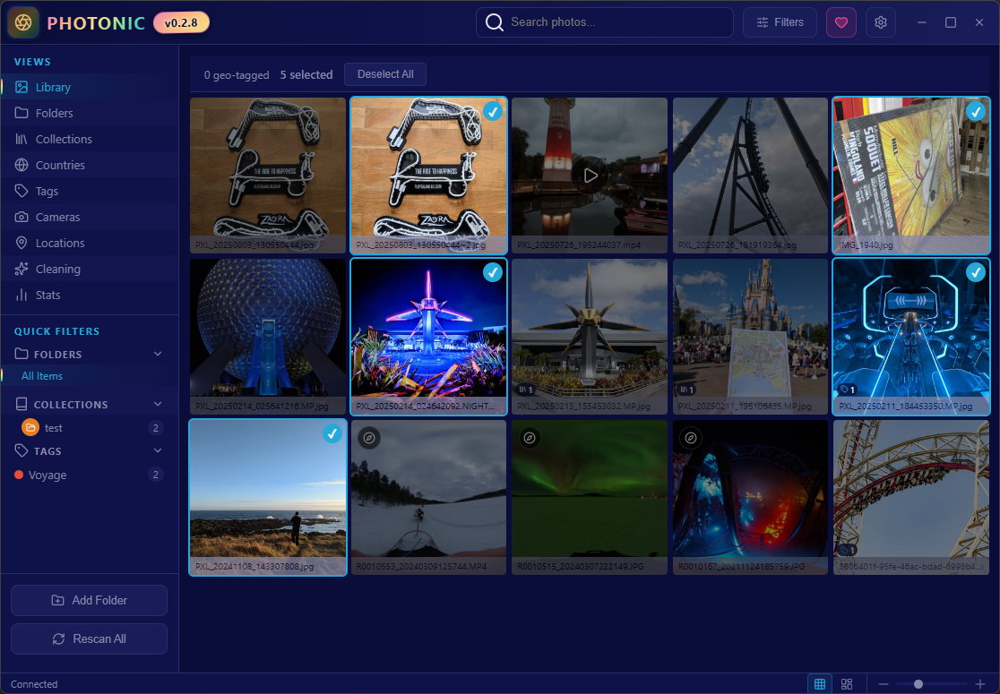

The **Library** view shows every photo matching the active search/filters, with infinite scrolling.

- **Multi-selection**: `Ctrl+click` (add/remove), `Shift+click` (range), or **rubber-band** selection by dragging on the grid. The selection bar shows "N selected" with a **Deselect All** button.
- **Thumbnail size**: slider at the bottom (30–450 px), − / + buttons, or `Ctrl+Scroll`.
- **Layout**: toggle **Grid** (uniform grid) / **Masonry** (Pinterest-style waterfall, beta).
- Card badges: compass for 360° photos, ▶ for videos, tag/collection count pills.
- A single click opens the detail view.

---

## 4. Photo Detail View

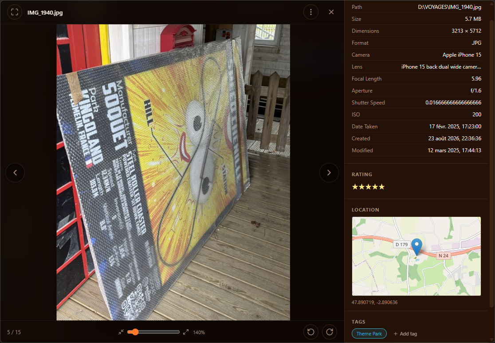

Opened by clicking any thumbnail. It includes:

- **Navigation**: ‹ › arrows (or `←` / `→` keys); "i / n" counter.
- **Zoom & rotation**: mouse wheel zooms (100–500%), drag to pan when zoomed in; ±90° rotation is persisted server-side.
- **⋮ menu (More actions)**: *Open in default app*, *Reveal in Explorer*, *Copy file path*, *Delete* (permanent deletion with confirmation).
- **Right panel**:
  - EXIF metadata: File, Path, Size, Dimensions, Format, Camera, Lens, Focal Length, Aperture, Shutter Speed, ISO, Date Taken…
  - **Rating**: clickable 1–5 ★ rating.
  - **Location**: mini map + GPS coordinates (when available).
  - **Tags**: colored pills (click = remove) + **+ Add tag** button (pick an existing tag or create one with its color).
  - **Collections**: pills + **+ Add to Collection** button (existing or new, with icon, color and parent collection).

---

## 5. 360° Photos

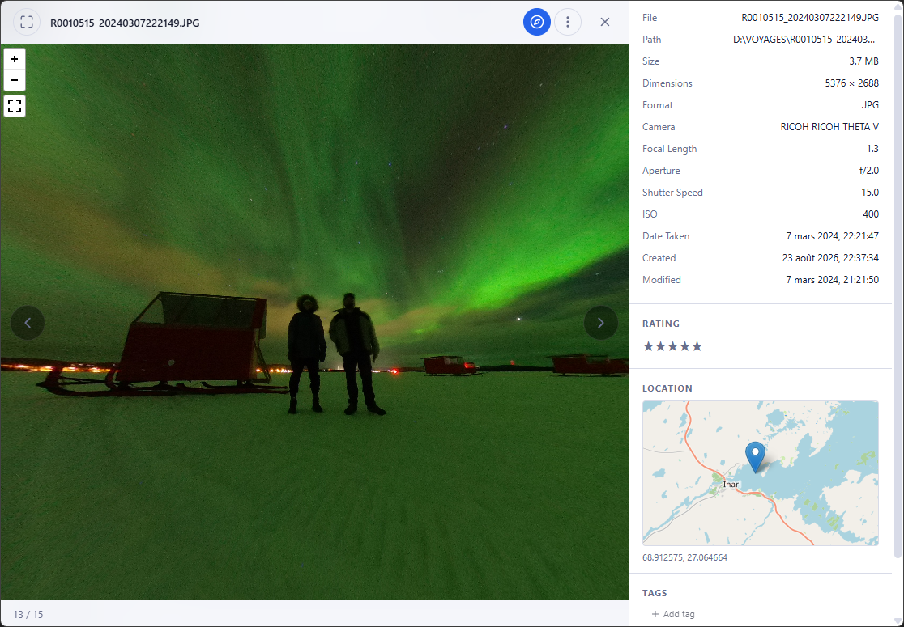

Panoramas are detected automatically (**THETA**, **Insta360**, **GoPro MAX** cameras, or ~2:1 aspect ratio) and open directly in the interactive viewer (drag to look around, mouse wheel to adjust the field of view). A compass button in the top bar toggles manually between flat and 360° views.

> 360° photos require WebGL (hardware acceleration enabled in your browser).

**360 videos** get the same kind of viewer (drag = orientation, wheel = FOV 30–110°).

---

## 6. Videos

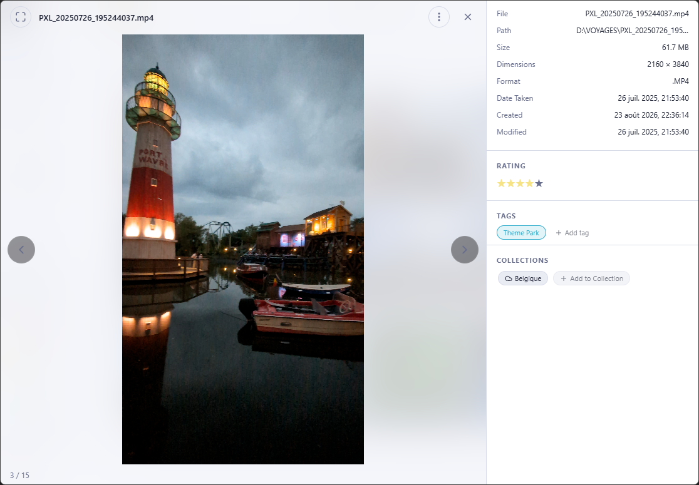

Extensions `.mp4`, `.mov`, `.avi`, `.mkv`, `.webm` are indexed with a thumbnail extracted from the first frame. In the grid they carry a ▶ badge; in the detail view they play in a built-in player (native controls, autoplay loop).

Files the browser can't play directly are automatically transcoded to H.264 MP4 in the background (ffmpeg) while the original starts streaming immediately.

---

## 7. Map (Locations)

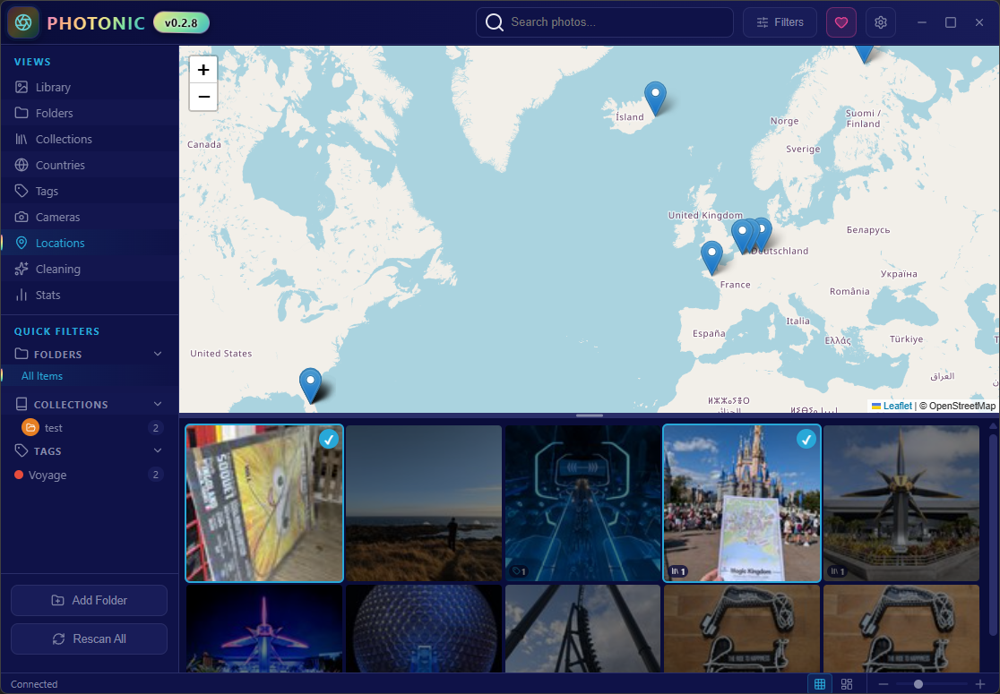

The **Locations** view shows an OpenStreetMap (Leaflet, no API key) of every geotagged photo, filtered like everywhere else.

- Markers are **clustered** above ~500 visible photos.
- The map auto-fits to the filtered photos and reloads on pan/zoom.
- **Photo strip** below the map (resizable): clicking a photo centers the map on its GPS point; clicking a marker opens the detail view.
- Header counter: "N geo-tagged".

---

## 8. Organization: Tags & Collections

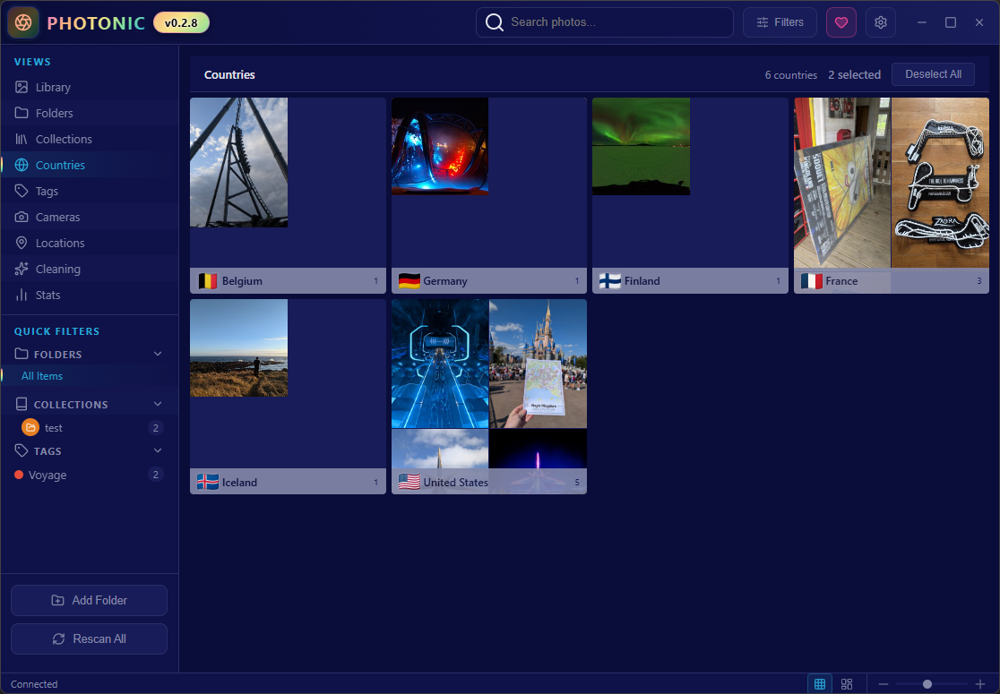

### Tags
Colored labels, nestable, applicable to any item. Assign them:
- from the detail view (**+ Add tag**);
- from the context menu (**Add Tag...** / **Remove Tags**);
- by **dragging & dropping** a selection onto a sidebar tag.

### Collections
Hierarchical binders you can customize: custom **icon**, color, parent collection. Breadcrumb navigation with direct and aggregated item counts (`Collections › Travel › Japan`).

The **Tags** and **Collections** sidebar views let you browse the library through these groupings.

---

## 9. Browsing by Folders, Countries, Cameras

Three more card-based browsing views:

| View | Cards |
|---|---|
| **Folders** | 📁 scanned folders, subfolder navigation, item counts |
| **Countries** | 4-thumbnail mosaic + flag + photo count (countries derived from GPS) |
| **Cameras** | 📷 camera bodies detected in EXIF data |

Each card leads to the matching photo grid (breadcrumb to go back).

---

## 10. Search & Filters

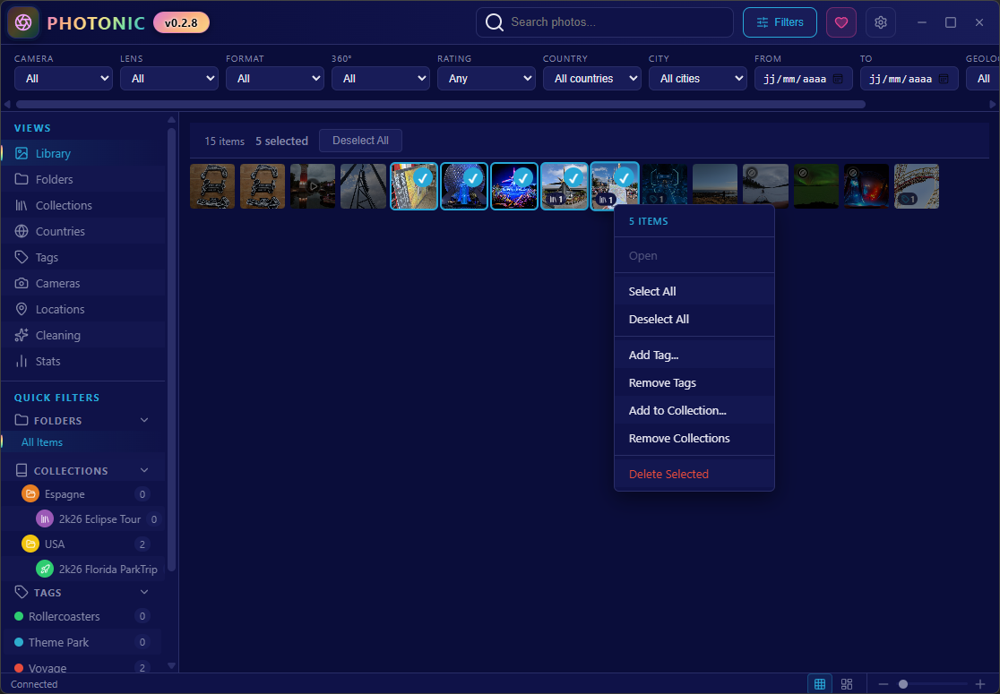

The header **search box** live-queries filename, camera and lens (300 ms debounce).

The **Filters** button opens a panel of combinable filters:

| Filter | Options |
|---|---|
| Camera / Lens | dropdowns populated from your library |
| Format | file extension |
| 360° | Yes / No |
| Rating | 1+ to 5 stars |
| Country / City | countries and cities (reverse geocoding) |
| From / To | date-taken range |
| Geolocalized | Yes / No |

**Clear** resets everything. Filters also apply to the map, statistics and browse views.

---

## 11. Context Menu (Right-click)

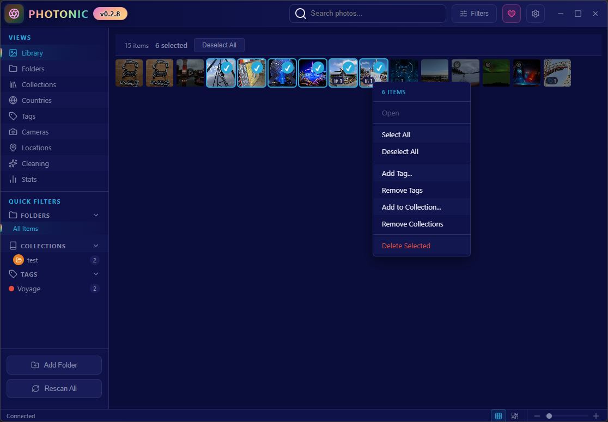

Right-clicking a thumbnail (or a selection) opens:

```
Open · Select · Deselect ─ Select All · Deselect All
─ Add Tag... · Remove Tags · Add to Collection... · Remove Collections
─ Delete Selected
```

On a single photo, **Open** replaces Select/Deselect; bulk deletions and removals always ask for confirmation.

---

## 12. Cleaning

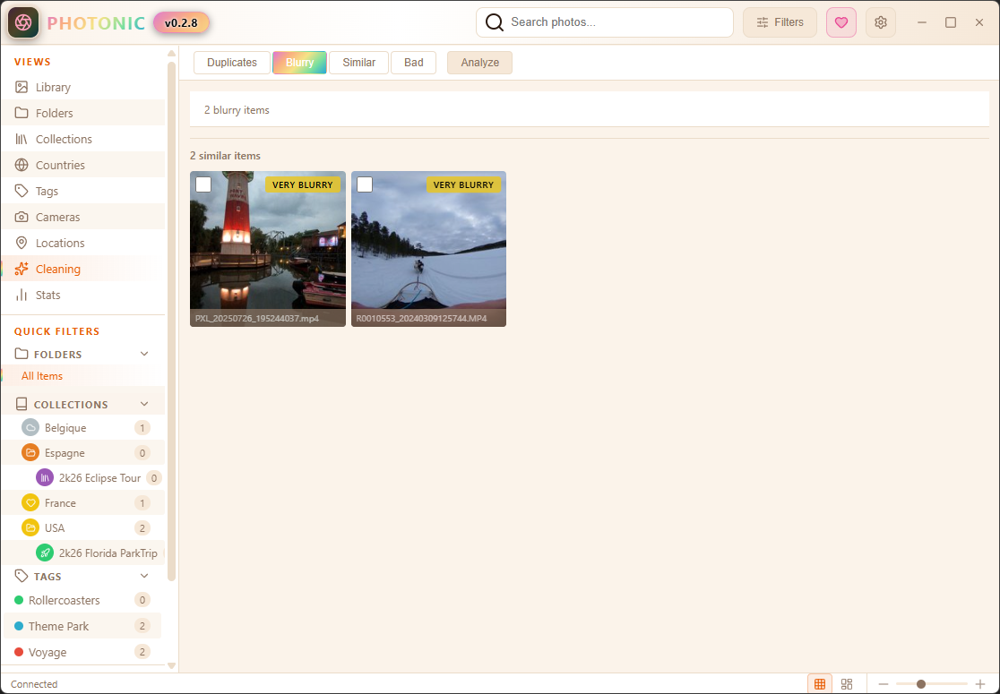

The **Cleaning** view analyzes the library (**Analyze** button, live progress) and sorts issues into four tabs:

| Tab | Detection |
|---|---|
| **Duplicates** | exact duplicates (identical MD5 hash), grouped by content |
| **Blurry** | blurry photos (sharpness score), *Very blurry* / *Blurry* badges |
| **Similar** | near-duplicate photos (perceptual hashing, low distance) |
| **Bad** | quality defects: *Black*, *White*, *Underexposed*, *Overexposed* |

Check the items to remove then hit **Delete Selected** (confirmation required): files are removed from disk, database and the thumbnail cache.

---

## 13. Statistics

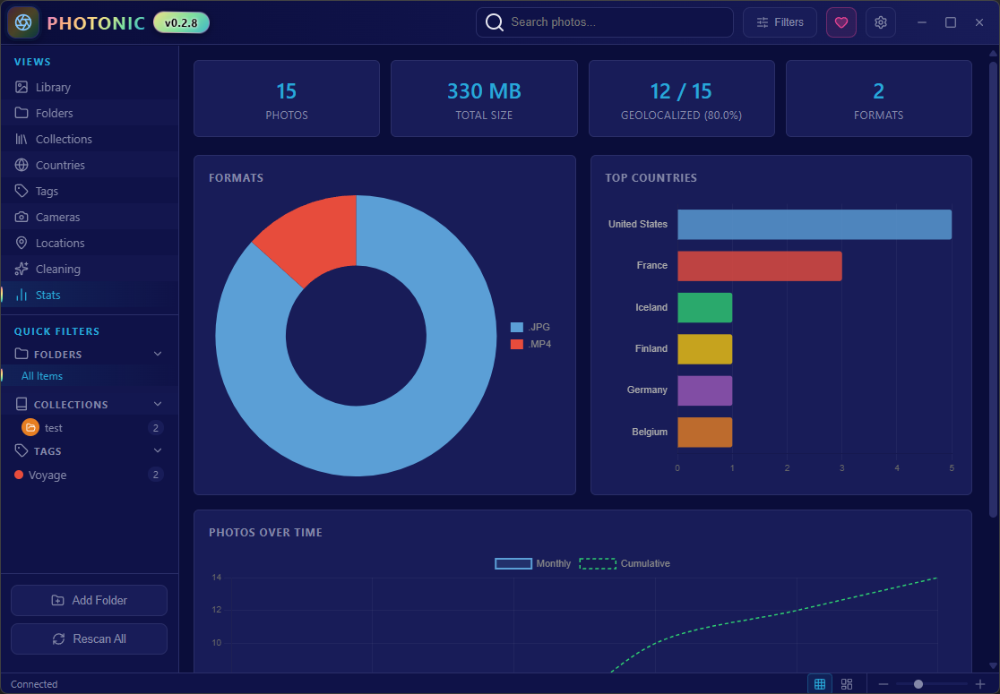

The **Stats** view shows:

- Four summary cards: **Photos** (total), **Total Size**, **Geolocalized (%)**, **Formats** (number of extensions).
- **Formats** chart (doughnut per extension).
- **Top Countries** chart (bars, top 15 — click a bar to open that country).
- **Photos over time** line chart: monthly and cumulative.

---

## 14. Settings

Open via the header gear. Four sections:

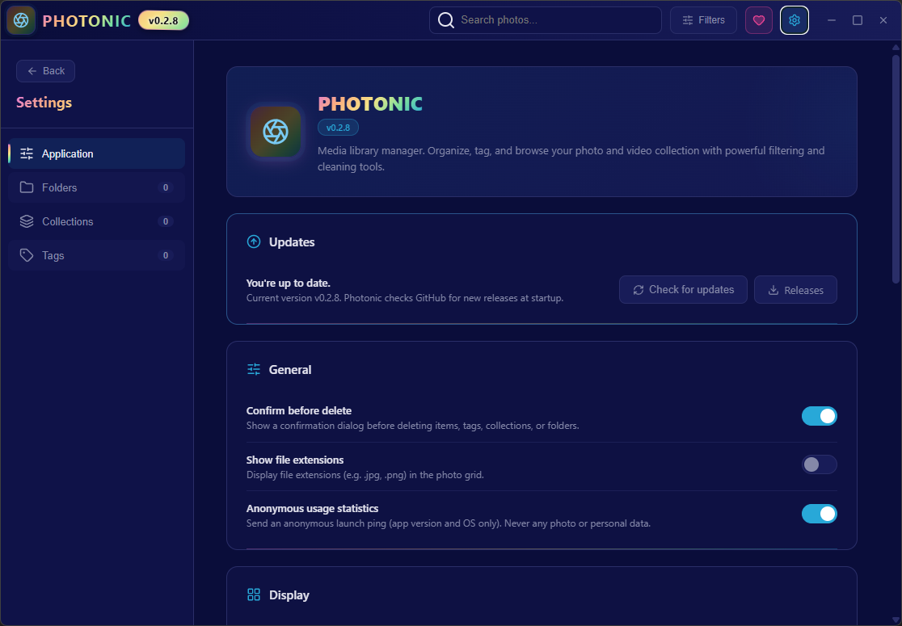

### Application
- **Updates**: checks for new versions (GitHub), link to releases.
- **General**: confirm before delete, show file extensions, anonymous usage statistics (version-only ping, never any personal data).
- **Display**: thumbnail size (60–450 px), default Grid/Masonry view.

### Appearance

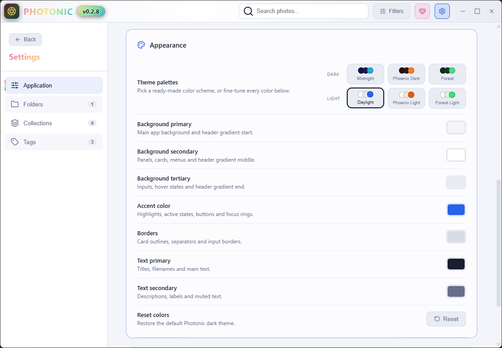

Six **ready-made palettes** (Dark: Midnight, Phoenix Dark, Forest — Light: Daylight, Phoenix Light, Forest Light) plus fine-grained color tuning: backgrounds (primary/secondary/tertiary), accent, borders, primary and secondary text. A **Reset** button restores the default dark theme.

### Tags

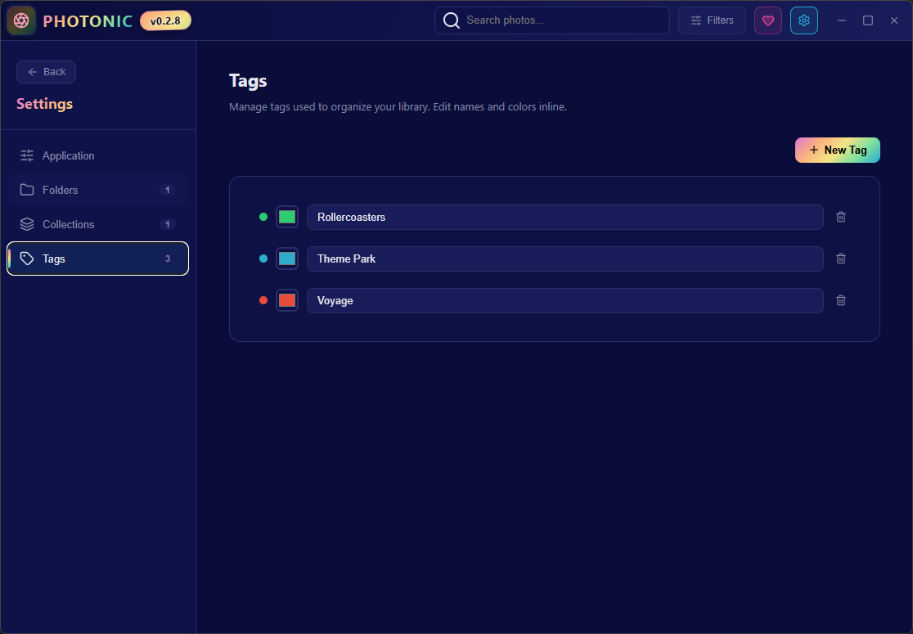

Create tags, rename them inline, recolor them; deletion asks for confirmation (items keep their other tags).

### Collections & Folders
Hierarchical collection management (icon, color, parent) and a tree of scanned folders with individual scan or removal (*removing a folder keeps its items in the library*).

---

## 15. Keyboard Shortcuts

| Shortcut | Action |
|---|---|
| `←` / `→` | Previous / next photo (detail view) |
| `Esc` | Close detail view, otherwise clear selection |
| `Ctrl+A` | Select all (visible items) |
| `Ctrl+Scroll` | Grow/shrink grid thumbnails |
| Mouse wheel (detail view) | Zoom 100–500% |
| `Enter` / `Esc` | Validate / cancel inline fields (tag, folder…) |

---

## 16. Updates & Changelog

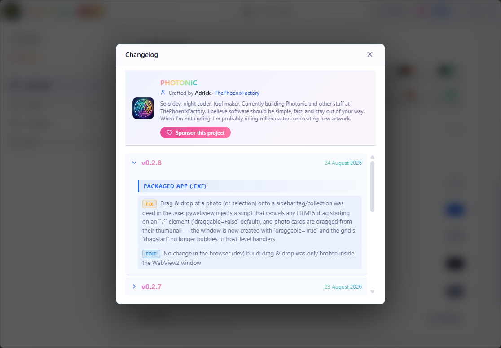

Photonic checks GitHub for new releases at startup. When an update exists, a pill appears in the header.

Clicking the **version badge** in the header opens the changelog (accordion per version, entries tagged ADD / FIX / EDIT / REMOVE) along with a **Sponsor this project** button.

---
*Guide written for Photonic v0.2.8 — screenshots live in [`screenshots/`](../screenshots/).*
